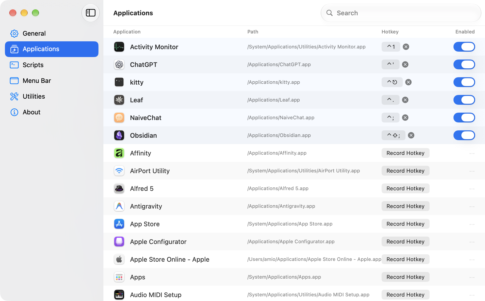
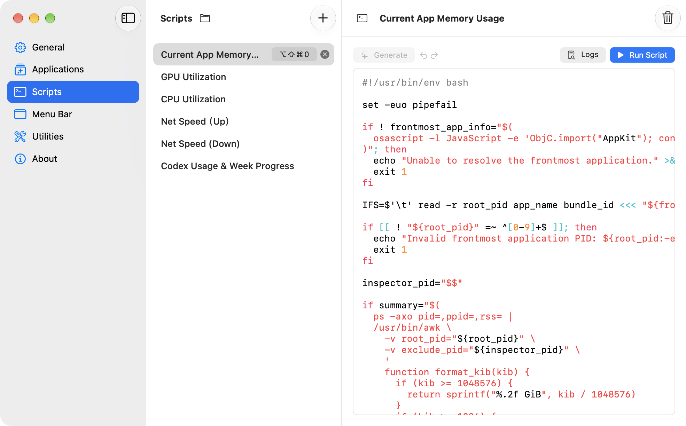
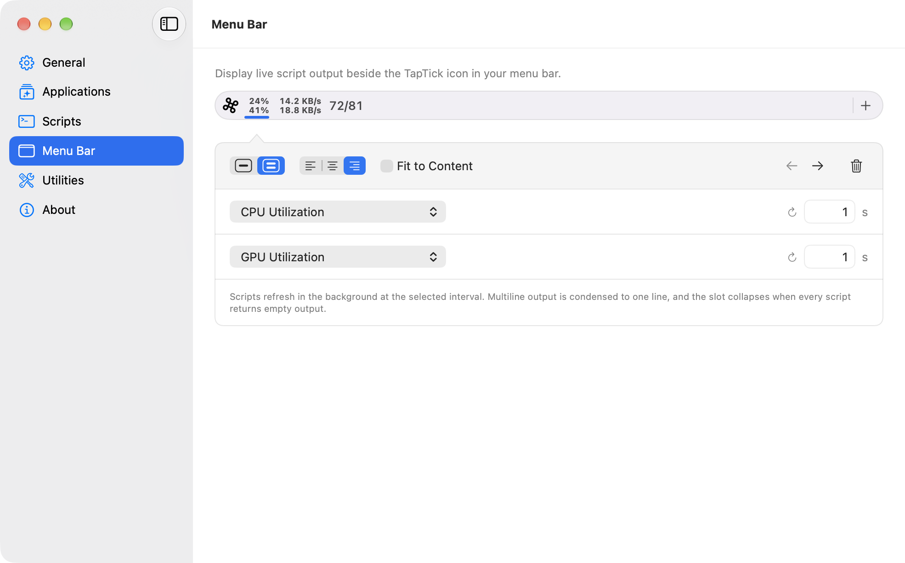
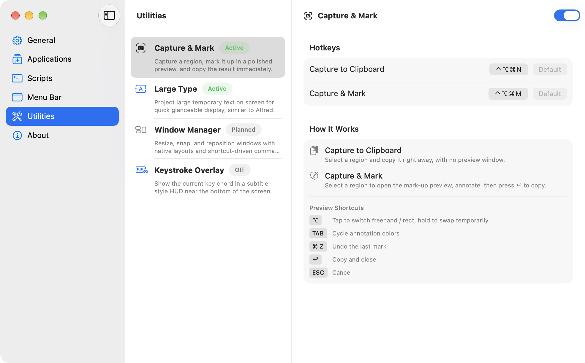

# TapTick

An app launcher, script runner, menu bar customizer, and utilities hub. The swiss army knife for Mac.

TapTick brings four essential Mac workflows together:

- **Applications:** Launch, focus, or hide any app with a global shortcut.

  

- **Scripts:** Write scripts then run them globally or display result in menu bar.

  

- **Menu Bar:** Show live script output in customizable one-line or two-line slots.

  

- **Utilities:** Keep focused Mac tools one shortcut away.
  - **Capture & Mark:** Capture a screen region to the clipboard, with optional line and rectangle annotations.
  - **Large Type:** Display text full-screen or turn it into a QR code.
  - **Keystroke Overlay:** Show key combinations in a customizable overlay for demos and recordings.
  - **Window Manager (planned):** Snap, resize, and reposition windows with keyboard shortcuts.

  

Install from [GitHub Releases](https://github.com/amio/TapTick/releases)

## Development

TapTick is built with SwiftUI and Swift 6, targeting macOS 26+.

Use `make` commands for common tasks:

```
help           Show available targets
setup          Install required tools and generate Xcode project
gen            Regenerate Xcode project from project.yml (run after editing project.yml)
open           Regenerate and open project in Xcode
build          Build app — Debug (via xcodebuild)
release        Build app — Release (via xcodebuild)
run            Build (Debug), replace the running instance, and launch `TapTick Dev.app`
test           Run unit tests via xcodebuild
uitest         Run UI tests via xcodebuild
test-all       Run all tests (unit + UI)
format         Auto-format all Swift source files with swift-format
lint           Lint Swift source files with swift-format (no writes)
version-patch  Bump patch version (1.0.0 → 1.0.1), commit and tag
version-minor  Bump minor version (1.0.0 → 1.1.0), commit and tag
version-major  Bump major version (1.0.0 → 2.0.0), commit and tag
version-build  Bump build number only, no semver change, commit and tag
archive        Create a Release archive (.xcarchive) signed with Developer ID
export         Export archive as a Developer ID-signed .app ready for notarization
notarize       Submit exported .app to Apple Notary Service and staple the ticket
dist           Full distribution pipeline: archive → export → notarize → staple → DMG
dmg            Package the notarized .app into a distributable DMG
clean          Remove build artifacts (keeps .xcodeproj)
reset          Full reset — also removes .xcodeproj (run 'make gen' afterwards)
ci             Full CI pipeline: lint → unit tests → release build
```

Repository utility scripts:

```
scripts/focused-app-memory.sh  Print the current frontmost app memory usage, including all descendant processes
```
